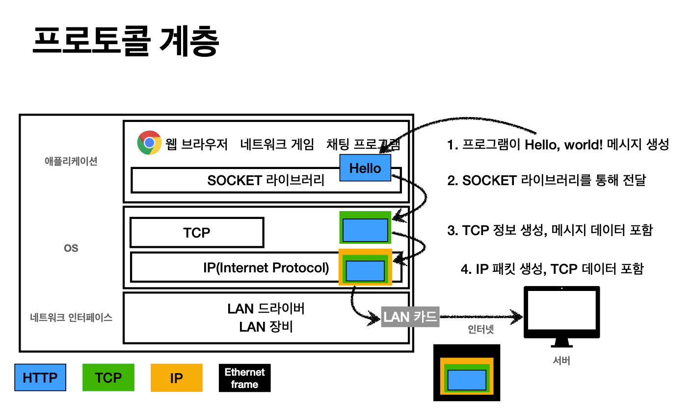
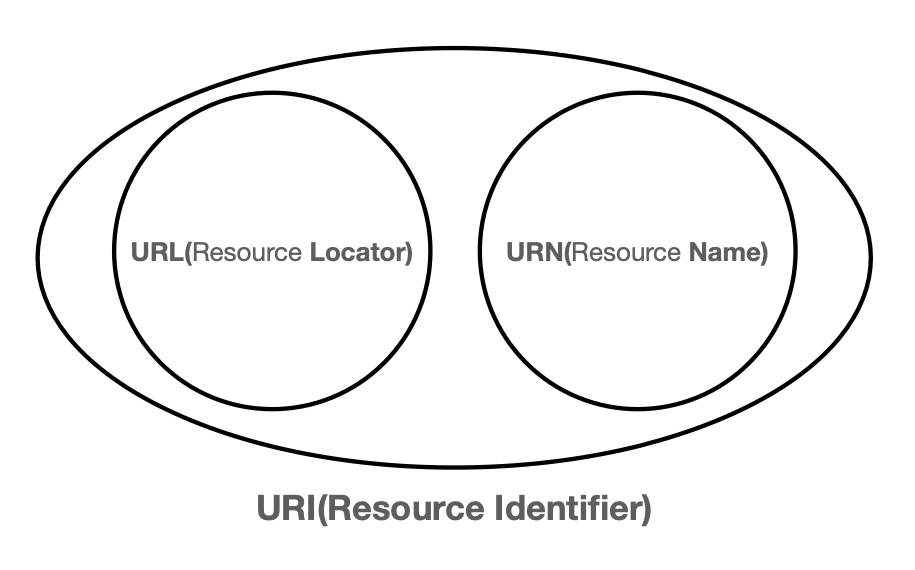
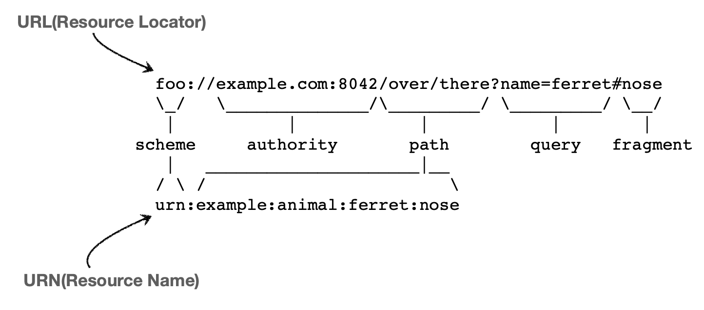
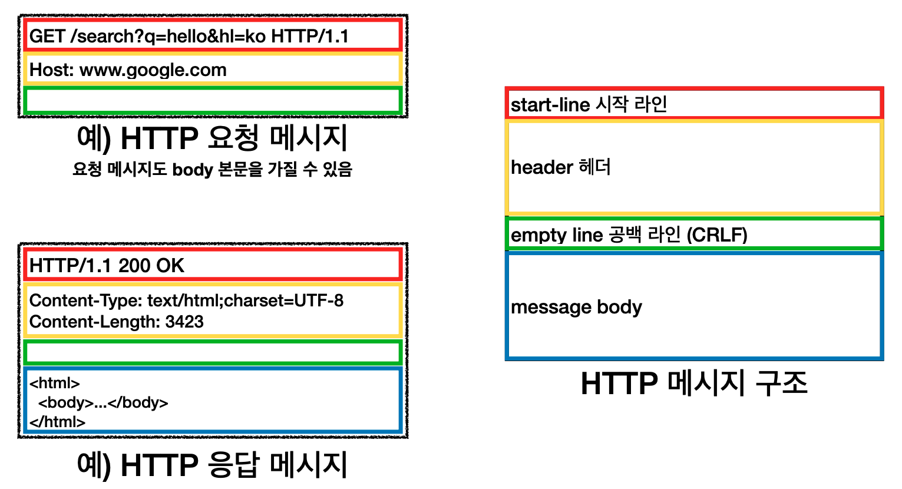
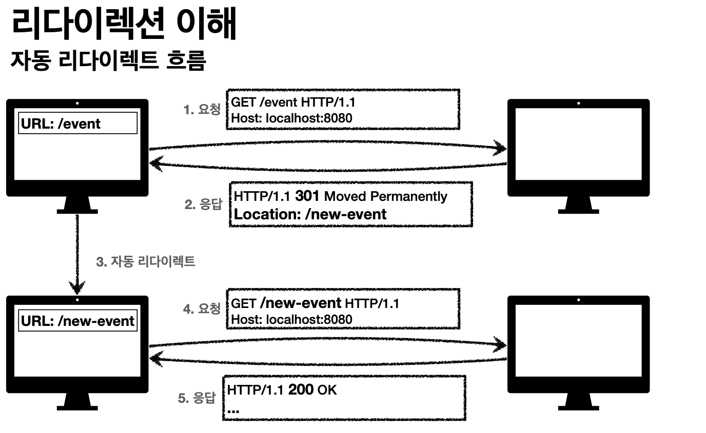

# [모든 개발자를 위한 HTTP 웹 기본 지식](https://www.inflearn.com/course/http-%EC%9B%B9-%EB%84%A4%ED%8A%B8%EC%9B%8C%ED%81%AC#)

## IP (인터넷 프로토콜)

- 인터넷의 고유 주소인 아이피를 각자 가지고 있다.
- 아이피끼리 통신일 때에는 패킷을 만들어서 통신한다.
- 패킷에는 출발IP, 도착IP 를 가지고 있고, 전달할 내용도 포함한다.
- 특징
  - 비연결성
    - 패킷을 받을 대상이 없거나 서비스 불능 상태여도 패킷 전송
  - 비신뢰성
    - 중간에 패킷이 사라질 수 있다.
    - 패킷이 보낸 순서대로 전달이 되지 않을 수 있다.
  - 프로그램 구분
    - 같은 IP를 사용하는 서버에서 통신하는 애플리케이션이 둘 이상이면?

### 패킷

- 패키지 + 버킷 합성어

## TCP / UDP

### TCP

인터넷 프로토콜 스택의 4계층
- 애플리케이션 계층 - HTTP, FTP
- 전송계층 - TCP, UDP
- 인터넷 계층 - IP
- 네트워크 인터페이스 계층

#### TCP 특징

> 전송 제어 프로토콜(Transmission Control Protocol)

- 연결지향 - TCP 3 way handshake (가상연결)
  1. SYN (클라이언트)
  2. SYN + ACK (서버)
  3. ACK + 데이터 (클라이언트)
   - SYN: 접속 요청
   - ACK: 요청 수락
     - 요청을 보내고, 연결 확인을 받으면 그 후에 데이터를 전송한다. (3번 통신이 이루어짐)
- 데이터 전달 보증
  - 데이터를 받으면 제대로 받았다고 응답을 보낸다.
- 순서 보장
  - 1, 3, 2 순으로 데이터가 잘못 전달되었을 경우 2번부터 다시 보내라고 서버가 클라이언트에게 요청한다.
- 신뢰할 수 있는 프로토콜
- 현재 대부분 TCP 사용  

#### UDP 특징

> 사용자 데이터그램 프로토콜(User Datagram Protocol)

- 하얀 도화지와 같다. (기능이 거의 없음)
- 연결지향 X
- 데이터 전달 보증 X
- 순서 보장 X
- 데이터 전달 및 순서가 보장되지 않지만, 단순하고 빠르다.
- 정리
  - IP 와 거의 같다.
    - PORT 추가
    - 체크섬 추가
  - 애플리케이션에서 추가 작업 필요

### PORT

> 항구

- 포트로 인해 한 아이피 주소 내에서 여러 애플리케이션을 실행하여 응답 / 요청이 가능해진다.

#### TCP/IP 패킷 정보

- 출발지 IP / PORT
- 목적지 IP / PORT
- 전송 데이터

#### IP / PORT

- 예시
  - IP: 아파트
  - PORT: 호수

#### PORT

- 0 ~ 65535: 할당 가능
- 0 ~ 1023: 잘 알려진 포트, 사용하지 않는 것이 좋다.
  - FTP - 20, 21
  - TELNET - 23
  - HTTP - 80
  - HTTPS - 443

### DNS

- 아이피는 기본적으로 외우기 어렵다. (100.234.50.31..?)
- 아이피는 변경이 될 수 있다.
- DNS 서버에서 도메인 주소를 구매해서 사용할 수 있다.
  - ex) google.com
  - DNS 서버에 도메인명을 찾아서 IP 주소를 응답받아 해당 IP 로 접속할 수 있게 된다.

## URI 와 웹 브라우저 요청 흐릅

### URI (Uniform Resource Identifier)

> 리소스 식별자

- URI는 URL, URN 을 포함하는 개념이다.
- 보통 URN 은 보기도 어렵고, 이해하기 쉽지 않기 때문에 URL 을 거의 사용한다.

### URI 단어 뜻

- Uniform: 리소스 식별하는 통일된 방식
- Resource: 자원, URI로 식별할 수 있는 모든 것 (제한 없음)
- Identifier: 다른 항목과 구분하는데 필요한 정보
  
### URL, URN 단어 뜻

- URL: Uniform Resource Locator
  - Locator: 리소스가 있는 위치를 지정
- URN: Uniform Resource Name
  - Name: 리소스에 이름을 부여

추가 설명
- 위치는 변할 수 있지만, 이름은 변하지 않는다.
- urn:isb:8960777331 (어떤 책의 isbn URN)
- URN 이름만으로 실제 리소스를 찾을 수 있는 방법이 보편화 되지 않는다.

### URL 알아보기

- scheme://[userinfo@]host[:prot][/path][?query][#fragment]
- https://www.google.com:443/search?q=hello&hl=ko

#### scheme

- 주로 프로토콜 사용
- 프로토콜: 어떤 방식으로 자원에 접근할 것인가 하는 약속된 규칙, 규약
  - 예) http, https, ftp 등

#### USERINFO

- URL 에 사용자 정보를 포함해서 인증
- 거의 사용하지 않는다.

#### HOST
- 호스트명
- 도메인명 또는 IP 주소를 직접 사용 가능

#### PORT

- 접속 포트
- http 는 80포트, https 는 443 포트를 주로 사용, 해당 포트는 생략이 가능하다.

#### PATH

- 리소스 경로, 계층적 구조
- 예시
  - /home/file1.jpg
  - members

#### QUERY

- key=value 형태
- ? 로 시작
- &로 이어서 여러 개를 붙일 수 있음.
  - keyA=valueA&keyB=valueB
- query parameter, query string 등으로 불린다.

#### FRAGMENT
- html 내부 북마크 등에서 사용된다.
- 서버에 전송하는 정보가 아니다.

### 웹 브라우저 요청 흐름

> https://www.google.com:443/search?q=hello&hl=ko

1. DNS 에 조회하여 IP 주소를 찾는다.
2. HTTP 요청 메세지 생성
> GET /search?q=hello&hl=ko HTTP/1.1  
Host: www.google.com
3. SOCKET 라이브러리를 통해 전달.
   - A: TCP/IP 연결 (IP, PORT)
   - B: 데이터 전달
4. TCP/IP 패킷 생성, HTTP 메시지 포함
5. 데이터를 서버에 전달.
6. TCP/IP 패킷을 버리고, HTTP 메시지를 열어서 확인.
7. HTTP 응답 메시지 생성
8. 응답 메시지 전달
9. 브라우저에서 해당 응답 메시지를 확인 후 렌더링

## 모든 것이 HTTP

### HTTP (HyperText Transfer Protocol)

> HTTP 메시지에 모든 것을 전송

- HTML, TEXT
- IMAGE, 음성, 영상, 파일
- JSON, XML (API)
- 거의 모든 형태의 데이터 전송 가능
- 서버 간 데이터를 주고 받을 때에도 대부분 HTTP 사용
- 현재 기준으로 HTTP 시대

#### HTTP 역사

- HTTP/0.9 1991년: GET 메서드만 지원, HTTP 헤더X
- HTTP/1.0 1996년: 메서드, 헤더 추가
- `HTTP/1.1 1997년: 가장 많이 사용, 우리에게 가장 중요한 버전`
  - RFC2068 (1997) -> RFC2616 (1999) -> RFC7230 ~ 7235 (2014)
- HTTP/2 2015년: 성능개선
- HTTP/3 진행중: TCP 대신 UDP 사용, 성능개선

#### 기반 프로토콜

- TCP: HTTP/1.1, HTTP/2
- UDP: HTTP/3
- 현재 주로 HTTP/1.1 사용
  - HTTP/2, HTTP/3 도 증가하는 추세

### HTTP 특징

- 클라이언트 서버 구조
- 무상태 프로토콜 (스테이스리스), 비연결성
- HTTP 메시지
- 단순함, 확장 가능

#### 클라이언트 서버 구조

- Request / Response 구조
- 클라이언트는 서버에 요청을 보내고, 응답을 대기
- 서버가 요청에 대한 결과를 만들어서 응답

#### Stateful, Stateless

무상태 프로토콜 스테이스리스(Stateless)

- 서버가 클라이언트의 상태를 보존하지 않는다.
- 장점: 서버 확장성이 높다. (스케일 아웃)
- 단점: 클라이언트가 추가 데이터 전송
  
Stateful, Stateless 차이
- Stateful (상태 유지): 중간에 다른 서버로 변경되면 안된다.
  - 중간에 다른 서버로 변경되면 상태 정보를 다른 서버에 미리 알려줘야 된다.
- Stateful (무상태): 중간에 다른 서버로 변경이 되어도 된다.
  - 접속이 갑자기 증가하면 여러 서버를 새로 투입하여도 문제가 되지 않는다.
- 무상태는 응답 서버를 쉽게 변경할 수 있다. -> 무한한 서버 증설이 가능하다.

무상태 실무 한계

- 로그인이 필요없는 단순한 서비스 소개 화면은 무상태로 설계해도 장애 발생 가능성이 적다.
- 로그인이 필요한 서비스 경우 사용자의 로그인 정보를 서버에서 유지를 해주어야 하는 문제점이 있다.
  - 일반적으로 브라우저 쿠키와 서버 세션 등을 사용해서 상태를 유지한다.
  - 상태 유지는 최소한만 사용한다.

#### 비 연결성(connectionless)

특징

- 요청 / 응답 후에 연결을 끊어버린다.
- 계속 연결되어 있지 않는 상태이기 때문에 서버 자원을 매우 효율적으로 사용할 수 있다.

한계와 극복
- TCP/IP 연결을 새로 맺어야 한다. - 3way handshake 시간 추가
- 웹 브라우저로 사이트를 요청하면 HTTP 뿐만 아니라 자바스크립트, css, 추가 이미지 등  
  수 많은 자원이 함께 다운로드 된다.
- 지금은 HTTP 지속 연결(Persistent Connections) 로 문제 해결
- HTTP/2, HTTP3 에서 더 많은 최적화

#### HTTP 메시지

`시작라인`

- 요청 메시지는 request-line
  - method SP(공백) request-target SP HTTP-version CRLF(엔터)
- 응답 메시지는 status-line
  - HTTP-version SP status-code SP reason-phrase CRLF

  
- method: GET, POST, PUT, DELETE
- request-target: 예시) /search?q=hello&hl=ko
- HTTP-version: HTTP/1.1
- status-code: 요청 성공, 실패를 나타냄.
  - 200 (성공), 400 (클라이언트 요청 오류), 500 (서버 내부 오류)
- reason-phrase: 사람이 이해할 수 있는 짧은 상태 코드 설명 글

`헤더`

- header-field = filed-name ":" OWS field-value OWS (OWS: 띄어쓰기 허용)

- 요청 메시지
  - `Host: www.google.com`
- 응답 메시지
  - Context-Type: text/html;charset=UTF-8
  - Context-Length: 3423
- 필드네임과 ":"은 붙여야 한다.
  
  
- HTTP 전송에 필요한 모든 부가 정보를 표시한다.
  - 메시지 바디의 내용, 메시지 바디의 크기, 압축 여부, 인증 정보, 요청 클라이언트(브라우저) 정보, 캐시 관리정보 ...
- 표준 헤더가 너무 많다.
  - https://en.wikipedia.org/wiki/List_of_HTTP_header_fields
- 필요 시 임의의 헤더 정보 추가를 할 수 있다.
  - 하지만, 이렇게 되면 약속된 클라이언트와만 통신이 가능하다.

`HTTP 메시지 바디`

- 실제 전송할 데이터
  - HTML 문서, 이미지, 영상, JSON 등등 byte 로 표현할 수 있는 모든 데이터 전송이 가능

## HTTP 메서드

### 리소스와 행위를 분리하자.

> 가장 주요한 것은 리소스를 식별하는 것

- `URI` 는 `리소스`만 식별하자!
- `리소스`와 해당 리소스를 대상으로 하는 `행위`를 분리
  - 리소스: 회원
  - 행위: 조회, 등록, 수정, 삭제
- 리소스는 명사, 행위는 동사
  - 예시) 회원을 조회하라.

### HTTP 메서드 종류

- GET: 리소스 조회 (유저 정보를 조회할 때)
  - 쿼리스트링으로 값을 넘겨서 조회
  - 메시지 바디를 사용할 수 있지만, 지원하지 않는 곳이 많기 때문에 권장하지 않는다.
- POST: 요청 데이터 처리, 주로 등록에 사용
  - 신규 데이터를 생성하거나 변경하는 경우
  - 프로세스를 처리해야 하는 경우 (배달 시작 등)
  - 다른 메서드로 처리하기 애매한 경우
    - JSON으로 조회 데이터를 넘겨야 하는데 GET 메서드를 사용하기 어려운 경우
- PUT: 리소스를 대체, 해당 리소스가 없으면 생성 (파일을 추가 혹은 덮을 때)
  - 리소스가 있으면 대체한다. (덮어버린다.)
    - 기존 리소스 정보를 아예 날리고, 받아온 리소스 정보를 새로 등록하는 것.
  - 리소스가 없으면 새로 생성한다.
  - 클라이언트가 리소스를 식별하고 위치를 알고 있는다.
- PATCH: 리소스 부분 변경 (유저의 정보를 수정할 때)
  - PUT 은 리소스를 아예 대체하지만, 리소스를 수정할 때 사용한다.
  - PATCH 가 지원이 안되는 경우도 있다. 그럴 땐 POST 를 사용하자.
- DELETE: 리소스 삭제 (유저 정보를 삭제할 때)

기타 메소드

- HEAD: GET과 동일하지만 메시지 부분을 제외하고, 상태 줄과 헤더만 반환
- OPTIONS: 대상 리소스에 대한 통신 가능 옵션(메서드)을 설명 (주로 CORS에서 사용)
- CONNECT: 대상 자원으로 식별되는 서버에 대한 터널을 설정
- TRACE: 대상 리소스에 대한 경로를 따라 메시지 루프백 테스트를 수행

### HTTP 메서드의 속성

- 안전 (Safe Method)
  - 리소스가 변경되는 메서드는 안전하지 않고, 조회하는 메서드는 안전하다고 표현한다.
  - GET, HEAD 안전하다.
  - POST, PUT, PATCH, DELETE 안전하지 않다.
- 멱등 (Idempotent)
  - 한 번 호출하든 두 번 호출하든 100번 호출하든 결과가 똑같다.
  - 외부 요인으로 인해서 결과가 달라지는 것은 고려하지 않는다.
  - GET, PUT, DELETE -> 멱등 메서드
  - POST -> 중복 결재 시 에러가 발생할 수 있다. 멱등이 아니다.
- 캐시가능 (Cacheable)
  - 응답 결과 리소스를 캐시해서 사용하는 지
  - GET, HEAD, POST, PATCH 캐시 가능
  - 하지만, 실제로는 GET, HEAD 만 캐시로 사용한다.
    - POST, PATCH 본문 내용까지 캐시 키로 고려해야 하지만 쉽지 않기 때문에.

## HTTP 메서드 활용

### 클라이언트에서 서버로 데이터 전송

데이터를 전달하는 방식은 크게 2가지가 있다.

- 쿼리 파라미터를 통한 데이터 전송
  - GET
  - 주로 정렬 필터(검색)
- 메시지 바디를 통한 데이터 전송
  - POST, PUT, PATCH
  - 회원 가입, 상품 주문, 리소스 등록, 리소스 변경

클라이언트에서 서버로 데이터 전송 4가지 상황

- 정적 데이터 조회
  - 이미지, 정적 텍스트 문서
  - 쿼리 파라미터를 사용하지 않고, 리소스 경로로 단순하게 조회하는 방식
- 동적 데이터 조회
  - 주로 검색, 게시판 목록에서 정렬 필터 (검색어)
  - 쿼리 파라미터 사용
- HTML Form 을 통한 데이터 전송
  - 회원 가입, 상품 주문, 데이터 변경
  - get으로 전송하면 쿼리 파라미터로
  - post 로 전송하면 HTTP 바디에 전송이 된다.
- HTTP API 를 통한 데이터 전송
  - 회원 가입, 상품 주문, 데이터 변경
  - 서버 to 서버, 앱 클라이언트, 웹 클라이언트(Ajax)

### 참고하면 좋은 URI 설계 개념

- 문서 (document)
  - 단일 개념 (파일 하나, 객체 인스턴스, 데이터베이스 row)
  - 예) /members/100, /files/star.jpg
- 컬렉션 (collection)
  - POST 기반 등록
  - 서버가 관리하는 리소스 디렉터리
  - 서버가 리소스의 URI를 생성하고 관리
  - 예) /members
- 스토어 (store)
  - PUT 기반 등록
  - 클라이언트가 관리하는 자원 저장소
  - 클라이언트가 리소스의 URI 를 알고 관리
  - 예) /files
- 컨트롤러 (controller), 컨트롤 URI
  - 문서, 컬렉션, 스토어로 해결하기 어려운 추가 프로세스 실행
  - 동사를 직접 사용
  - 예) /members/{id}/delete

## 상태 코드

> 클라이언트가 보낸 요청의 처리 상태를 응답에서 알려주는 기능

- 1xx (Informational): 요청이 수신되어 처리 중
  - 요청이 처리 중이라는 뜻
  - 실무에서 거의 사용하지 않는다. (사용하는 걸 본 적이 없음)
- 2xx (Successful): 요청 정상 처리
  - 200: OK 정상처리
  - 201: Created 요청이 성공해서 새로운 리소스가 생성 됨
  - 202: Accepted 요청이 접수되었으나 처리가 되지 않음 (잘 사용하지 않음)
  - 204: No Content 요청이 성공했지만, 응답 페이로드 본문에 보낼 데이터가 없음
- 3xx (Redirection): 요청을 완료하려면 추가 행동이 필요
  - 영구 리다이렉션
    - 301: 요청 메서드가 GET 으로 변하고, 본문이 제거될 수 있다. (MAY)
    - 308: 301과 기능은 같지만, 요청 메서드와 본문을 유지한다.
  - 일시 리다이렉션
    - 302: 요청 메서드가 GET 으로 변하고, 본문이 제거될 수 있음 (MAY)
    - 307: 302와 기능은 같음. 요청 메서드와 본문 유지 (요청 메서드를 변경하면 안됨. MUST NOT)
    - 303: 302와 기능은 같음. 요청 메서드가 GET 으로 변경
  - 기타 리다이렉션
    - 304: 캐시를 목적으로 사용
      - 클라이언트에게 리소스가 수정되지 않았음을 알려준다.
      - 클라이언트는 로컬PC 에 저장된 캐시를 재사용한다. (캐시로 리다이렉트 한다.)
      - 304 응답은 응답에 메시지 바디를 포함하면 안된다. (로컬 캐시를 사용해야 한다.)
      - 조건부 GET, HEAD 요청시 사용
- 4xx (Client Error): 클라이언트 오류, 잘못된 문법 등으로 서버가 요청을 수행할 수 없음
  - 401 (Unauthorized): 인증오류. (로그인 정보가 없거나 잘못 되었을 때)
  - 403 (Forbidden): 요청은 받았지만 승인 거부. (인증 자격은 있지만, 접근 권한이 아닌 경우)
    - 어드민 등급 리소스에 일반 등급 로그인 정보가 접근했을 때
  - 404 (Not Found): 요청 리소스가 서버에 없음. 해당 리소스 정보를 숨기고 싶을 때
- 5xx (Server Error): 서버 오류, 서버가 정상 요청을 처리하지 못함
  - 500 (Internal Server Error): 서버 내부 문제로 오류 발생. 애매하면 전부 500으로 보냄
  - 503 (Service Unavailable): 서버가 일시적인 과부하 또는 예정된 작업으로 잠시 요청을 처리할 수 없음
    - Retry-After 헤더 필드로 얼마 뒤에 복구되는지 보낼 수 있음
    - 하지만, 보통 500 에러는 개발자 실수로 많이 발생하기 때문에 503 보다는 500 에러를 더 자주 접하게 됨.

### 리다이렉션 이해

- 웹 브라우저는 3xx 응답의 결과에 Location 헤더가 있으면, Lovation 위치로 자동 이동

#### 종류

- 영구 리다이렉션 - 특정 리소스의 URI가 영구적으로 이동
  - 예) /members -> /users
  - 예) /event -> /new-evnet
- 일시 리다이렉션 - 일시적인 변경
  - 주문 완료 후 주문 내역 화면으로 이동
  - PRG: Post / Redirect / Get
- 특수 리다이렉션
  - 결과 대신 캐시를 사용

## HTTP 헤더1 - 일반 헤더

### RFC 723x변화

- 엔티티 (Entity) -> 표현 (Representation)
- Representation = Representation Metadata + Representation Data
- 표현 = 표현 메타데이터 + 표현 데이터
  - 표헌 메타데이터: 헤더에 포함 되어 있는 표현 데이터를 해석할 수 있는 정보
  - 표현 데이터 : 메시지 본문 내용
    - 메시지 본문 = 페이로드 (payload) 와 같은 의미로 사용

### 표현

> 표현 헤더는 전송, 응답 둘다 사용이 가능하다.
  
- Content-Type: 표현 데이터의 형식
  - 본문 내용이 어떤 형식인지
  - text/html; charset=utf-8
  - application/json
  - image/png
- Content-Encoding: 표현 데이터의 압축 방식
  - 데이터를 전달하는 곳에서 압축 후 인코딩 헤더를 통해 클라이언트에서 어떤 걸로 압축했는지 알려준다.
  - gzip
  - deflate
  - identity
- Content-Language: 표현 데이터의 자연 언어
  - ko
  - en
  - en-US
- Content-Length: 표현 데이터의 길이
  - 바이트 단위로 표현되며 본문 데이터의 길이를 표시한다.

### 협상 (콘텐츠 네고시이션)

> 클라이언트가 선호하는 표현 요청  
> 협상헤더는 `요청`시에만 사용한다.

- Accept: 클라이언트가 선호하는 미디어 타입 전달
- Accept-Charset: 클라이언트가 선호하는 문자 인코딩
- Accept-Encoding: 클라이언트가 선호하는 압축 인코딩
- Accept-Language: 클라이언트가 선호하는 자연 언어

### 전송방식

- 단순 전송
  - 기본 전송 방식
  - Content-Length 를 보낸다.
- 압축 전송
  - 내용을 압축하여 용량을 확 줄일 수 있게 된다.
  - Content-Encoding 을 보내서 어떤 압축 형식인지 보낸다.
- 분할 전송
  - Transfer-Encoding 을 보낸다.
  - 전체 길이를 알 수 없기 때문에 Content-Length 를 보낼 수 없다.
- 범위 전송
  - 클라이언트에서는 Range 를 보낸다.
  - 서버에서는 Content-Range 를 보낸다.
  - 클라이언트에서 받고 끊겼을 경우 처음부터 받는 게 아닌 특정 부분부터 전송을 받도록 요청하고, 전달하는 방식

### 일반 정보

- From: 유저 에이전트의 이메일 정보
  - 일반적으로 잘 사용하지 않는다.
  - 검색 엔진 같은 곳에서 주로 사용한다.
  - 요청에서 사용한다.
- Referer: 이전 웹 페이지 주소
  - 현재 요청된 페이지의 이전 페이지 주소
  - 유입 경로를 분석할 때 사용한다.
  - 요청에서 사용한다.
  - referrer의 오타이다.
- User-Agent: 유저 에이전트 애플리케이션 정보
  - 웹 브라우저 정보 (클라이언트 애플리케이션 정보)
  - 통계 정보
  - 어떤 종류의 브라우저에서 장애가 발생하는지 파악할 때 사용
  - 요청에서 사용한다.
- Server: 요청을 처리하는 오리진 서버의 소프트웨어 정보
  - 응답에서 사용한다.
- Date: 메시지가 생성된 날짜
  - 응답에서만 사용한다.

### 특별한 정보

- Host: 요청한 호스트 정보(도메인)
  - 요청에서 `필수`로 사용한다.
  - 하나의 서버가 여러 도메인을 처리해야 할 때
  - 하나의 IP 주소에 여러 도메인이 적용되었을 때
- Location: 페이지 리다이렉션
  - 3xx 응답의 결과에 Location 헤더가 있으면, Location 위치로 자동으로 이동한다.
  - 201: Location 값은 요청에 의해 생성된 리소스 URI
  - 3xx: Location 값은 요청을 자동으로 리다이렉션하기 위한 대상 리소스
- Allow: 허용 가능한 HTTP 메서드
  - 405 (Method Not Allowed) 에서 응답에 포함해야 한다.
  - Allow: GET, HEAAD, PUT
  - 만약 POST 로 요청이 왔을 때 서버에 POST 에 대한 결과가 없을 때 보내는 방식
  - 하지만, 잘 사용하지 않는다.
- Retry-After: 유저 에이전트가 다음 요청을 하기까지 기다려야 하는 시간
  - 503(Service Unavailable): 서비스가 언제까지 불능인지 알려줄 수 있다.
  - Retry-After: Fri, 31 Dec 1999 23:59:59 GMT (날짜 표기)
  - Retry-After: 120 (초단위 표기)

### 인증

- Authorization: 클라이언트 인증 정보를 서버에 전달
  - Basic xxxxxxxxxxxxxxxxxxxxxxx
- WWW-Authenticate: 리소스 접근 시 필요한 인증 방법 정의
  - 리소스 접근 시 필요한 인증 방법을 정의한다.
  - 401 Unauthorized 응답과 함께 사용한다.
  - 접근이 불가능할 경우 어떤 방식으로 인증해야하는지 알려준다.

### 쿠키

- Set-Cooke: 서버에서 클라이언트로 쿠키 전달 (응답)
- Cookie: 클라이언트가 서버에서 받은 쿠키를 저장하고, HTTP 요청 시 서버로 전달
  
- 예) set-cookie: sessionId=abcde 1234; expires=Sat, 26-Dec-2020 00:00:00 GMT; path=/; domain=.google.com; Secure
- 사용처
  - 사용자 로그인 세션 관리
  - 광고 정보 트래킹
- 쿠키 정보는 항상 서버에 전송이 된다.
  - 네트워크 트래픽 추가 유발
  - 최소한의 정보만 사용 (세션 id, 인증 토큰)
  - 서버에 전송하지 않고, 웹 브라우저 내부에 데이터를 저장하고 싶다면 웹 스토리지 (localStorage, sessionStorage)
  - 주의!
    - 보안에 민감한 데이터는 저장하면 안된다. (주민번호, 신용카드 정보 등등)

#### 쿠키 생명주기

- expires=Sat, 26-Dec-2020 00:00:00 GMT;
  - 만료일이 되면 쿠키 삭제
- max-age=3600 (3600초)
  - 0이나 음수를 지정하면 쿠키 삭제
- 세션 쿠키: 만료 날짜를 생략하면 브라우저 종료 시 까지만 유지
- 영속 쿠키: 만료 날짜를 입력하면 해당 날짜까지 유지

#### 쿠키 도메인

- 명시: 명시한 문서 기준 도메인 + 서브 도메인 포함
  - domain=naver.com 를 지정해서 쿠키 생성
    - naver.com / dev.naver.com 도 쿠키 접근 가능
- 생략: 현재 문서 기준 도메인에만 적용
  - naver.com 에서 쿠키를 생성하고, 도메인 지정을 생략했을 경우 naver.com 만 접근 가능

#### 쿠키 경로

- 예) path=home
  - 이 경로를 포함한 하위 경로 페이지만 쿠키가 접근 가능
  - 일반적으로 / 루트로 지정한다.

#### 쿠키 보안

- Secure
  - 쿠키는 http, https 를 구분하지 않고, 전송하지만 `Secure` 를 적용하면 HTTPS 에서만 전송
- HttpOnly
  - XSS 공격을 방지한다.
  - 자바스크립트에서 접근 불가 (document.cookie 가 안됨)
  - HTTPS 전송에만 사용한다.
- SameSite
  - XSRF 공격을 방지한다.
  - 요청 도메인과 쿠키에 설정된 도메인이 같은 경우만 쿠키 전송
  - 사용할 경우 더 찾아본 후 사용하기 

## HTTP 헤더 2 - 캐시와 조건부 요청

### 캐시

캐시가 없을 때

- 데이터가 변경되지 않아도 계속 네트워크를 통해서 데이터를 다운로드 받아야 한다.
- 인터넷 네트워크는 매우 느리고 비싸다.
- 브라우저 로딩 속도가 느리다.
- 느린 사용자 경험.

캐시 적용할 때

- 캐시 가능 시간동안 네트워크 사용하지 않아도 된다.
- 비싼 네트워크 사용량을 줄일 수 있다.
- 한 번 들어갔던 곳을 다시 들어갈 경우 브라우저 로딩 속도가 매우 빠르다.

### 검증 헤더와 조건부 요청1

- 캐시 유효 시간이 초과해도, 서버의 데이터가 갱신되지 않았다면
  - 304 Not Modified + 헤더 메타 정보만 응답 (바디 X)
- 클라이언트는 서버가 보낸 응답 헤더 정보로 캐시의 메타 정보를 갱신
- 클라이언트는 캐시에 저장되어 있는 데이터를 재활용 한다.
- 결과적으로 네트워크 다운로드가 발생하긴 하지만, 용량이 적은 헤더 정보만 다운로드 한다.
- 매우 실용적인 해결책

### 검증 헤더와 조건부 요청2

- Last-Modified, If-Modified-Since 단점
  - 1초 미만 단위로 캐시를 조정할 수 없다.
  - 날짜 기반의 로직을 사용한다.
  - 데이터를 수정해서 날짜는 다르지만, 같은 데이터를 수정해서 결과가 같은 경우
  - 서버에서 별도의 캐시 로직을 관리하고 싶은 겨우

> ETag, If-None-Match

- ETag (Entity Tag)
  - 캐시용 데이터에 임의의 고유한 버전 혹은 이름을 달아서 사용한다.
    - 예) ETag: "v1.0", ETag: "a2jdaspd3"
  - 데이터가 변경되면 이 이름을 바꾸어서 변경한다. (Hash 를 다시 생성)
    - aaaaa -> bbbbb

- 단순하게 ETag만 서버에 보내서 같으면 유지, 다르면 다시 받기
- 캐시 제어 로직을 서버에서 완전히 관리한다.
- 클라이언트는 단순히 이 값을 서버에 제공한다. (클라이언트는 캐시 메커니즘을 모른다.)
- 예)
  - 서버는 베타 오픈 기간인 3일 동안 파일이 변경되어도 ETag 를 동일하게 유지한다.
  - 애플리케이션 배포 주기에 맞추어 ETag 모두 갱신한다.

### 캐시 제어 헤더

- Cache-Control: 캐시 제어
  - max-age: 캐시 유효 시간, 초 단위로 계산
  - no-cache: 데이터는 캐시가 되고, 항상 origin 서버에 검증하고 사용한다.
  - no-store: 데이터에 민간함 정보가 있으므로 저장하면 안된다. (메모리에서 사용하고 최대한 빠르게 삭제)
- Pragma: 캐시 제어 (하위 호환)
  - no-cache 의 하위호환으로서 HTTP 1.0 하위 호환한다.
- Expires: 캐시 유효 기간 (하위 호환)
  - 캐시 만료 일을 정확한 날짜로 지정한다.
  - HTTP 1.0 부터 사용했다.
  - 지금은 더 유연한 max-age 를 권장한다.
  - max-age 와 함께 사용하면 Expires 는 무시된다.

### 프록시 서버

> 미국에 있는 서버를 직접 접근하려면 매우 느리기 때문에 한국에 프록시 서버를 두고,  
> 한국에 있는 프록시 서버에서 미리 데이터를 다운받고 우리가 한국 서버에 접근해서 사용하는 방식.  
> 요청한 데이터가 프록시 서버에 없다면 당연히 미국 서버에 접근한다.  
> 이럴 때 미국 서버를 원 (origin) 서버라고 부른다.

#### Cache-Control

- public : 응답이 public 캐시에 저장이 되어도 됨.
- private: 응답이 해당 사용자만을 위한 것이다. (사용자 정보 등) private 캐시에 저장해야 한다. (기본 값)
- s-maxage: 프록시 캐시에만 적용되는 max-age
- Age: 오리진 서버에서 응답 후 프록시 캐시 내에 머문 시간 (초)